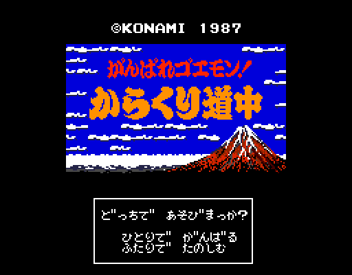
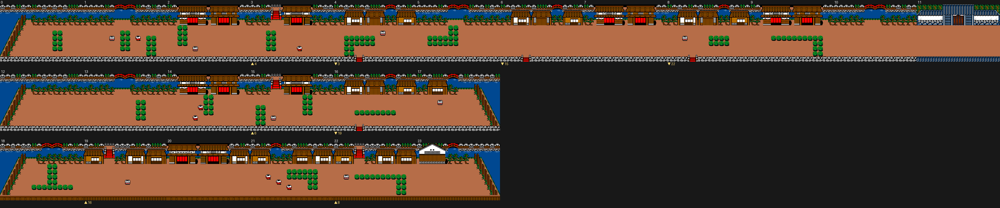
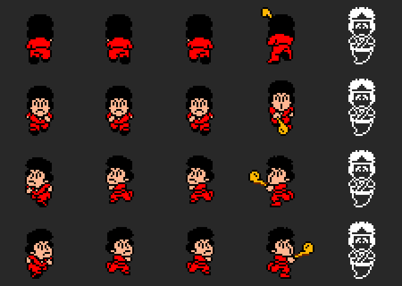
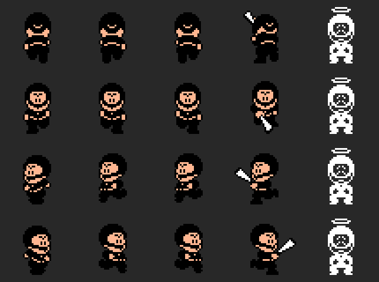
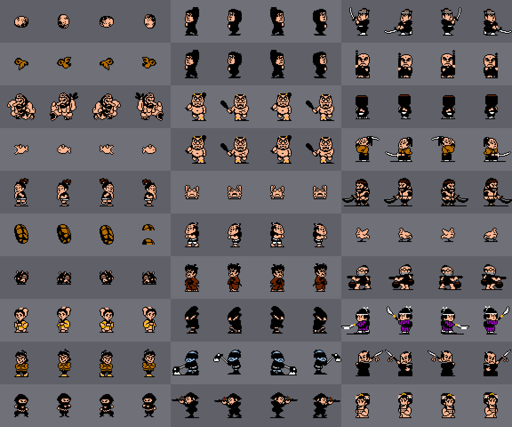
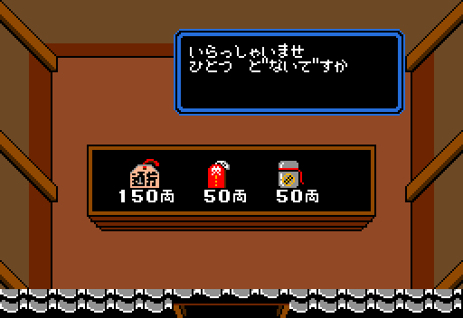

# The game

Goemon (or Ebisumaru, player 2) crosses **7 stages of 7 areas**: **49 areas and
1608 screens** (the cells). In each stage, areas 0 to 4 are streets and
countryside, area 5 is walls and area 6 is the inside of a castle, the
biggest one (66 to 80 cells).

Every picture on this page is **drawn from the bytes of the ROM** by the tools
in `tools/`, which follow the cartridge's own steps, and checked against
openMSX dumps (`C-BIOS_MSX2_JP`). Under each one it says which table it comes
from.

## The title screen

The menu has two options, one or two players, and the two take turns. The
second button leads to the password screen (state 0x0E). The logo and the
title match openMSX with not a single pixel different (`titulo.py coteja`).
With Q\*bert or the Game Master in the other slot, the title screen shows
another menu: see [Findings](FINDINGS.md).

## The 49 areas

*Area 0 of stage 1. Each row is a **street**: cells following each other from
left to right (p00:4188). Under each cell, the arrows say which cell its
up and down exits lead to (0xB7D0). The blue arrow on the right marks a
street that starts over.*

The up and down exits are not geometric: in this area, going up from cell 3
leads to cell 4, which is also to its right. That is why the maps are laid
out by streets and not as a grid. Moving figures are not drawn, since they
depend on the game; the fixed objects (0xA08E) are. All 49 area entrances are
checked against openMSX (screen, characters and palette).

| Stage | Area 0 | 1 | 2 | 3 | 4 | 5 | 6 |
|---|---|---|---|---|---|---|---|
| 1 | [24](imagenes/zona_1_0.png) | [14](imagenes/zona_1_1.png) | [16](imagenes/zona_1_2.png) | [20](imagenes/zona_1_3.png) | [26](imagenes/zona_1_4.png) | [38](imagenes/zona_1_5.png) | [66](imagenes/zona_1_6.png) |
| 2 | [16](imagenes/zona_2_0.png) | [20](imagenes/zona_2_1.png) | [24](imagenes/zona_2_2.png) | [18](imagenes/zona_2_3.png) | [20](imagenes/zona_2_4.png) | [38](imagenes/zona_2_5.png) | [70](imagenes/zona_2_6.png) |
| 3 | [34](imagenes/zona_3_0.png) | [18](imagenes/zona_3_1.png) | [18](imagenes/zona_3_2.png) | [18](imagenes/zona_3_3.png) | [24](imagenes/zona_3_4.png) | [44](imagenes/zona_3_5.png) | [80](imagenes/zona_3_6.png) |
| 4 | [28](imagenes/zona_4_0.png) | [18](imagenes/zona_4_1.png) | [22](imagenes/zona_4_2.png) | [30](imagenes/zona_4_3.png) | [30](imagenes/zona_4_4.png) | [38](imagenes/zona_4_5.png) | [66](imagenes/zona_4_6.png) |
| 5 | [30](imagenes/zona_5_0.png) | [24](imagenes/zona_5_1.png) | [22](imagenes/zona_5_2.png) | [16](imagenes/zona_5_3.png) | [18](imagenes/zona_5_4.png) | [38](imagenes/zona_5_5.png) | [70](imagenes/zona_5_6.png) |
| 6 | [22](imagenes/zona_6_0.png) | [34](imagenes/zona_6_1.png) | [30](imagenes/zona_6_2.png) | [20](imagenes/zona_6_3.png) | [30](imagenes/zona_6_4.png) | [44](imagenes/zona_6_5.png) | [66](imagenes/zona_6_6.png) |
| 7 | [24](imagenes/zona_7_0.png) | [16](imagenes/zona_7_1.png) | [22](imagenes/zona_7_2.png) | [34](imagenes/zona_7_3.png) | [32](imagenes/zona_7_4.png) | [58](imagenes/zona_7_5.png) | [80](imagenes/zona_7_6.png) |

*Cells in each area (first byte of its record, 0xB7D0); each number links to
its map.*

## One screen

A cell is **8 × 6 blocks of 4 × 4 characters** (p00:5275). It is built at
0xD800 and painted character by character with HMMM, from page 1 to page 0
(p00:534E), in SCREEN 5. Each area has its graphics set (0xB8EC, six in all)
with its characters and its palette: the base one (0xA3E6), the set's
(0xA37A) and a few colours for the spot, which some exits change (0xA4C5).

## Goemon and Ebisumaru

*The 20 poses of each: patterns, sprites and colours checked against the pose
in each dump.*

Life starts at 0x10 (0x20 with one of the keywords), and the timer runs in
BCD (0xC4B0). Below 50 seconds the hurry-up music plays (p01:714E).

## The enemies

*The 30 types that appear in the cells, with the base pose and the next three
(0xAA51), each with the palette of the first area where it appears.*

Each cell has a set of figures: a nibble in its area's table (0x9BF0) picks a
list in its graphics set's table (0x5BB2). The lists match the figures in the
49 dumps. When the blow lands, each type adds the money in 0xB86D (5, 10 or
20 ryo, or nothing), except types 8 and 0x21, which cost 50 ryo; touching
them, on the other hand, gives 1000 points (p01:79C8). 107 figures from the
dumps are checked with zero differences.

Types 0x12 and 0x1D do not appear in the cells: they are figures from the
end-of-stage scene (p02:9AA6, p02:9B6E).

## The interiors

There are **21 interiors** (0x9567); each has its figures and what it sells.

- **0 to 15:** shops.
- **16:** for 900 ryo it takes you to a secret passage.
- **17:** the dice.
- **18:** asks whether you will stay the night, and fills your life.
- **19:** sends away anyone without the boss's letter.
- **20:** gives hints.

All 21 are drawn and checked with zero differences against openMSX, and the
shops open as well.

Prices (0x9371) depend on three things:

- **The shop class**, which comes from the area's graphics set.
- **How far the game has gone**, in four bands: up to area 9, 10 to 19, 20 to
  39, and 40 onwards.
- **How many times you have bought the item** in that area: each purchase
  doubles the price (p02:930C).

| Item | What it does (0xADEB) | Price, class 0, band 0 |
|---|---|---|
| 1, 10 | one more, up to 3 | 30, 150 |
| 2, 8 | you have it | 20, 120 |
| 3–7 | five hits | 50 |
| 9 | 100 seconds | 40 |
| 11 / 12 | 16 / 8 life | 30 / 20 |
| 13 | 200 more seconds | 50 |

The whole table, with the three classes and the four bands (in ryo):

| Class, band | 1 | 2 | 3 | 4 | 5 | 6 | 7 | 8 | 9 | 10 | 11 | 12 | 13 | 14 | 15 | 16 |
|---|---|---|---|---|---|---|---|---|---|---|---|---|---|---|---|---|
| 0, 0 | 30 | 20 | 50 | 50 | 50 | 50 | 50 | 120 | 40 | 150 | 30 | 20 | 50 | 5 | 50 | 100 |
| 0, 1 | 60 | 40 | 100 | 100 | 100 | 100 | 100 | 250 | 180 | 300 | 60 | 40 | 100 | 0 | 150 | 240 |
| 0, 2 | 90 | 60 | 280 | 280 | 300 | 300 | 300 | 400 | 440 | 800 | 90 | 60 | 280 | 0 | 500 | 420 |
| 0, 3 | 120 | 100 | 600 | 600 | 400 | 400 | 400 | 500 | 600 | 1500 | 120 | 100 | 600 | 0 | 700 | 620 |
| 1, 0 | 30 | 20 | 40 | 40 | 50 | 50 | 50 | 150 | 50 | 150 | 30 | 20 | 40 | 0 | 50 | 100 |
| 1, 1 | 60 | 40 | 80 | 80 | 150 | 150 | 150 | 300 | 160 | 400 | 60 | 40 | 80 | 0 | 200 | 280 |
| 1, 2 | 90 | 60 | 250 | 250 | 400 | 400 | 400 | 500 | 1200 | 700 | 90 | 60 | 250 | 0 | 500 | 400 |
| 1, 3 | 150 | 120 | 420 | 420 | 600 | 600 | 600 | 800 | 1200 | 1200 | 150 | 120 | 420 | 0 | 700 | 520 |
| 2, 0 | 50 | 30 | 80 | 80 | 50 | 50 | 50 | 400 | 100 | 2000 | 50 | 30 | 80 | 0 | 50 | 100 |
| 2, 1 | 100 | 60 | 150 | 150 | 100 | 100 | 100 | 500 | 250 | 2000 | 100 | 60 | 150 | 0 | 200 | 380 |
| 2, 2 | 150 | 100 | 300 | 300 | 250 | 250 | 250 | 600 | 600 | 2000 | 150 | 100 | 300 | 0 | 600 | 580 |
| 2, 3 | 250 | 200 | 700 | 700 | 500 | 500 | 500 | 1000 | 1500 | 2000 | 250 | 200 | 700 | 0 | 800 | 780 |

## The password

It is 9 characters. 0x30 is subtracted from each, they are shuffled with the
key at 0xEBC6 and carry a checksum (p01:6C7A). They store the stage, the
player, the area, the cell and the colours. F2 in the pause shows it, and the
same screen accepts four keywords (see [Findings](FINDINGS.md)).

## The end of each stage

The stage's lord says his text (0x9E0B, one per stage) and promises to rule
better. The game has four different endings: they are in
[Findings](FINDINGS.md).
