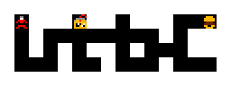

# El juego

Goemon (o Ebisumaru, el jugador 2) cruza **7 fases de 7 zonas**: **49 zonas y
1608 pantallas** (las casillas). En cada fase, las zonas 0 a 4 son calles y
campo, la 5 son murallas y la 6 es el interior de un castillo, la más grande
(de 66 a 80 casillas).

Todas las imágenes de esta página están **dibujadas desde los bytes de la
ROM** con las herramientas de `tools/`, que siguen los pasos del propio
cartucho, y cotejadas contra volcados de openMSX (`C-BIOS_MSX2_JP`). Debajo
de cada una se dice de qué tabla sale.

## La pantalla de título

El menú tiene dos opciones, uno o dos jugadores, y los dos juegan por turnos.
El segundo botón lleva a la pantalla de la contraseña (estado 0x0E). El
logotipo y el título coinciden con openMSX sin un punto distinto (`titulo.py
coteja`). Con Q\*bert o el Game Master en la otra ranura, el título saca otro
menú: está en [Hallazgos](HALLAZGOS.md).

## Las 49 zonas

*La zona 0 de la fase 1. Cada fila es una **calle**: casillas seguidas de
izquierda a derecha (p00:4188). Debajo de cada casilla, las flechas dicen a
qué casilla llevan sus salidas de arriba y de abajo (0xB7D0). La flecha azul
de la derecha marca una calle que vuelve a empezar.*

Las salidas de arriba y de abajo no son geométricas: en esta zona, subir desde
la casilla 3 lleva a la 4, que también está a su derecha. Por eso los planos
van por calles y no en rejilla. Las figuras que se mueven no se pintan, porque
dependen de la partida; las cosas fijas (0xA08E), sí. Las 49 entradas de zona
están cotejadas contra openMSX (pantalla, caracteres y paleta).

| Fase | Zona 0 | 1 | 2 | 3 | 4 | 5 | 6 |
|---|---|---|---|---|---|---|---|
| 1 | [24](../imagenes/zona_1_0.png) | [14](../imagenes/zona_1_1.png) | [16](../imagenes/zona_1_2.png) | [20](../imagenes/zona_1_3.png) | [26](../imagenes/zona_1_4.png) | [38](../imagenes/zona_1_5.png) | [66](../imagenes/zona_1_6.png) |
| 2 | [16](../imagenes/zona_2_0.png) | [20](../imagenes/zona_2_1.png) | [24](../imagenes/zona_2_2.png) | [18](../imagenes/zona_2_3.png) | [20](../imagenes/zona_2_4.png) | [38](../imagenes/zona_2_5.png) | [70](../imagenes/zona_2_6.png) |
| 3 | [34](../imagenes/zona_3_0.png) | [18](../imagenes/zona_3_1.png) | [18](../imagenes/zona_3_2.png) | [18](../imagenes/zona_3_3.png) | [24](../imagenes/zona_3_4.png) | [44](../imagenes/zona_3_5.png) | [80](../imagenes/zona_3_6.png) |
| 4 | [28](../imagenes/zona_4_0.png) | [18](../imagenes/zona_4_1.png) | [22](../imagenes/zona_4_2.png) | [30](../imagenes/zona_4_3.png) | [30](../imagenes/zona_4_4.png) | [38](../imagenes/zona_4_5.png) | [66](../imagenes/zona_4_6.png) |
| 5 | [30](../imagenes/zona_5_0.png) | [24](../imagenes/zona_5_1.png) | [22](../imagenes/zona_5_2.png) | [16](../imagenes/zona_5_3.png) | [18](../imagenes/zona_5_4.png) | [38](../imagenes/zona_5_5.png) | [70](../imagenes/zona_5_6.png) |
| 6 | [22](../imagenes/zona_6_0.png) | [34](../imagenes/zona_6_1.png) | [30](../imagenes/zona_6_2.png) | [20](../imagenes/zona_6_3.png) | [30](../imagenes/zona_6_4.png) | [44](../imagenes/zona_6_5.png) | [66](../imagenes/zona_6_6.png) |
| 7 | [24](../imagenes/zona_7_0.png) | [16](../imagenes/zona_7_1.png) | [22](../imagenes/zona_7_2.png) | [34](../imagenes/zona_7_3.png) | [32](../imagenes/zona_7_4.png) | [58](../imagenes/zona_7_5.png) | [80](../imagenes/zona_7_6.png) |

*Casillas de cada zona (primer byte de su ficha, 0xB7D0); cada número lleva a
su plano.*

## Una pantalla

Una casilla son **8 × 6 bloques de 4 × 4 caracteres** (p00:5275). Se monta en
0xD800 y se pinta carácter a carácter con HMMM, de la página 1 a la 0
(p00:534E), en SCREEN 5. Cada zona tiene su juego de gráficos (0xB8EC, seis en
total) con sus caracteres y su paleta: la base (0xA3E6), la del juego (0xA37A)
y unos colores del sitio que cambian algunas salidas (0xA4C5).

## Goemon y Ebisumaru

*Las 20 poses de cada uno: dibujos, sprites y colores cotejados con la pose de
cada volcado.*

La vida empieza en 0x10 (0x20 con una de las claves), y el tiempo corre en BCD
(0xC4B0). Por debajo de 50 segundos suena la música de las prisas (p01:714E).

## Los enemigos

*Los 30 tipos que salen en las casillas, con la pose base y las tres
siguientes (0xAA51), cada uno con la paleta de la primera zona donde sale.*

Cada casilla tiene un conjunto de figuras: un nibble en la tabla de su zona
(0x9BF0) elige una lista en la tabla de su juego de gráficos (0x5BB2). Las
listas coinciden con las figuras de los 49 volcados. Cuando el golpe le da,
cada tipo suma el dinero de 0xB86D (5, 10 o 20 ryo, o nada), salvo los tipos 8
y 0x21, que cuestan 50 ryo; tocarlos, en cambio, da 1000 puntos (p01:79C8).
Hay 107 figuras de los volcados cotejadas a cero.

Los tipos 0x12 y 0x1D no salen en las casillas: son figuras de la escena del
final de fase (p02:9AA6, p02:9B6E).

## Los interiores

Hay **21 interiores** (0x9567); cada uno tiene sus figuras y lo que vende.

- **0 a 15:** tiendas.
- **16:** por 900 ryo te lleva a un pasadizo secreto.
- **17:** los dados.
- **18:** pregunta si te quedas a dormir, y llena la vida.
- **19:** echa a quien no lleva la carta del jefe.
- **20:** da consejos.

Los 21 están dibujados y cotejados a cero contra openMSX, y los de las tiendas
también abiertos.

Los precios (0x9371) dependen de tres cosas:

- **La clase de tienda**, que sale del juego de gráficos de la zona.
- **Lo avanzado de la partida**, en cuatro tramos: hasta la zona 9, de la 10
  a la 19, de la 20 a la 39, y de la 40 en adelante.
- **Cuántas veces has comprado la cosa** en esa zona: cada compra dobla el
  precio (p02:930C).

| Cosa | Lo que hace (0xADEB) | Precio, clase 0, tramo 0 |
|---|---|---|
| 1, 10 | una más, hasta 3 | 30, 150 |
| 2, 8 | la tienes | 20, 120 |
| 3–7 | cinco golpes | 50 |
| 9 | 100 segundos | 40 |
| 11 / 12 | 16 / 8 de vida | 30 / 20 |
| 13 | 200 segundos más | 50 |

La tabla entera, con las tres clases y los cuatro tramos (en ryo):

| Clase, tramo | 1 | 2 | 3 | 4 | 5 | 6 | 7 | 8 | 9 | 10 | 11 | 12 | 13 | 14 | 15 | 16 |
|---|---|---|---|---|---|---|---|---|---|---|---|---|---|---|---|---|
| 0, 0 | 30 | 20 | 50 | 50 | 50 | 50 | 50 | 120 | 40 | 150 | 30 | 20 | 50 | 5 | 50 | 100 |
| 0, 1 | 60 | 40 | 100 | 100 | 100 | 100 | 100 | 250 | 180 | 300 | 60 | 40 | 100 | 0 | 150 | 240 |
| 0, 2 | 90 | 60 | 280 | 280 | 300 | 300 | 300 | 400 | 440 | 800 | 90 | 60 | 280 | 0 | 500 | 420 |
| 0, 3 | 120 | 100 | 600 | 600 | 400 | 400 | 400 | 500 | 600 | 1500 | 120 | 100 | 600 | 0 | 700 | 620 |
| 1, 0 | 30 | 20 | 40 | 40 | 50 | 50 | 50 | 150 | 50 | 150 | 30 | 20 | 40 | 0 | 50 | 100 |
| 1, 1 | 60 | 40 | 80 | 80 | 150 | 150 | 150 | 300 | 160 | 400 | 60 | 40 | 80 | 0 | 200 | 280 |
| 1, 2 | 90 | 60 | 250 | 250 | 400 | 400 | 400 | 500 | 1200 | 700 | 90 | 60 | 250 | 0 | 500 | 400 |
| 1, 3 | 150 | 120 | 420 | 420 | 600 | 600 | 600 | 800 | 1200 | 1200 | 150 | 120 | 420 | 0 | 700 | 520 |
| 2, 0 | 50 | 30 | 80 | 80 | 50 | 50 | 50 | 400 | 100 | 2000 | 50 | 30 | 80 | 0 | 50 | 100 |
| 2, 1 | 100 | 60 | 150 | 150 | 100 | 100 | 100 | 500 | 250 | 2000 | 100 | 60 | 150 | 0 | 200 | 380 |
| 2, 2 | 150 | 100 | 300 | 300 | 250 | 250 | 250 | 600 | 600 | 2000 | 150 | 100 | 300 | 0 | 600 | 580 |
| 2, 3 | 250 | 200 | 700 | 700 | 500 | 500 | 500 | 1000 | 1500 | 2000 | 250 | 200 | 700 | 0 | 800 | 780 |

## Los pasadizos secretos

*El mapa del pasadizo de la zona 1-0, como lo enseña el juego (p03:BB1B): cada
casilla es una pieza de 8 × 8, y Goemon, arriba a la izquierda, está donde se
empieza.*

En cada zona, menos en la 5 de cada fase, el interior 16 ofrece llevarte «al
pasadizo secreto del fondo». Son **42 pasadizos**, hechos con **16 dibujos**
(0xA86D) que se repiten con lo de dentro en otro sitio (0xA575). Se recorren
en primera persona: arriba avanza, izquierda y derecha giran, y abajo da media
vuelta (p03:B8C3).

- **La entrada** cuesta 900 ryo, o el precio de la cosa 15 si se lleva la
  cosa 0x0A (p02:92E3). Cada vez que se entra en la misma zona, cuesta el
  doble. Ya pagada, se entra pulsando arriba en el fondo del interior
  (p01:7D0D).
- **Dentro** hay 200 ryo, una cosa 9 más, el mapa, una vida y la salida
  (p03:BC5C). Cada cosa se coge una vez, y vuelven al volver a la zona.
- **El mapa**, si se ha cogido, lo enseña el botón. No pinta ni el mapa ni la
  vida, y la salida solo con el secreto del menú (ver
  [Hallazgos](HALLAZGOS.md)).
- **La salida** da 10000 puntos la primera vez en la zona y te deja en la
  calle, delante de la puerta.

Los 42 están cotejados contra openMSX: la rejilla de 0xD800, el mapa punto a
punto y la paleta.

| Fase | Zona 0 | 1 | 2 | 3 | 4 | 6 |
|---|---|---|---|---|---|---|
| 1 | [2](../imagenes/pasadizo_1_0.png) | [4](../imagenes/pasadizo_1_1.png) | [11](../imagenes/pasadizo_1_2.png) | [18](../imagenes/pasadizo_1_3.png) | [19](../imagenes/pasadizo_1_4.png) | [26](../imagenes/pasadizo_1_6.png) |
| 2 | [6](../imagenes/pasadizo_2_0.png) | [13](../imagenes/pasadizo_2_1.png) | [22](../imagenes/pasadizo_2_2.png) | [16](../imagenes/pasadizo_2_3.png) | [8](../imagenes/pasadizo_2_4.png) | [51](../imagenes/pasadizo_2_6.png) |
| 3 | [13](../imagenes/pasadizo_3_0.png) | [15](../imagenes/pasadizo_3_1.png) | [7](../imagenes/pasadizo_3_2.png) | [8](../imagenes/pasadizo_3_3.png) | [16](../imagenes/pasadizo_3_4.png) | [3](../imagenes/pasadizo_3_6.png) |
| 4 | [19](../imagenes/pasadizo_4_0.png) | [9](../imagenes/pasadizo_4_1.png) | [6](../imagenes/pasadizo_4_2.png) | [24](../imagenes/pasadizo_4_3.png) | [28](../imagenes/pasadizo_4_4.png) | [44](../imagenes/pasadizo_4_6.png) |
| 5 | [10](../imagenes/pasadizo_5_0.png) | [20](../imagenes/pasadizo_5_1.png) | [12](../imagenes/pasadizo_5_2.png) | [4](../imagenes/pasadizo_5_3.png) | [15](../imagenes/pasadizo_5_4.png) | [54](../imagenes/pasadizo_5_6.png) |
| 6 | [20](../imagenes/pasadizo_6_0.png) | [27](../imagenes/pasadizo_6_1.png) | [20](../imagenes/pasadizo_6_2.png) | [7](../imagenes/pasadizo_6_3.png) | [24](../imagenes/pasadizo_6_4.png) | [22](../imagenes/pasadizo_6_6.png) |
| 7 | [13](../imagenes/pasadizo_7_0.png) | [10](../imagenes/pasadizo_7_1.png) | [14](../imagenes/pasadizo_7_2.png) | [21](../imagenes/pasadizo_7_3.png) | [24](../imagenes/pasadizo_7_4.png) | [0](../imagenes/pasadizo_7_6.png) |

*La casilla del interior 16 en cada zona; cada número lleva al mapa de su
pasadizo.*

## La contraseña

Son 9 caracteres. A cada uno se le resta 0x30, se desordenan con la clave de
0xEBC6 y llevan suma de control (p01:6C7A). Guardan la fase, el jugador, la
zona, la casilla y los colores. F2 en la pausa la enseña, y la misma pantalla
acepta cuatro claves (ver [Hallazgos](HALLAZGOS.md)).

## El final de cada fase

El señor de la fase dice su texto (0x9E0B, uno por fase) y promete gobernar
mejor. El juego tiene cuatro finales distintos: están en
[Hallazgos](HALLAZGOS.md).
